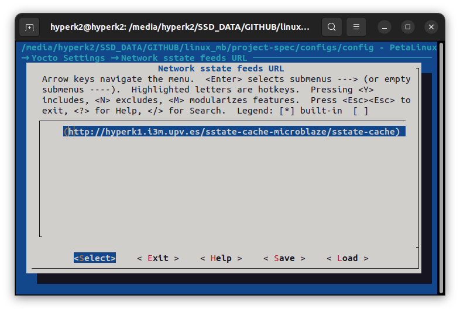
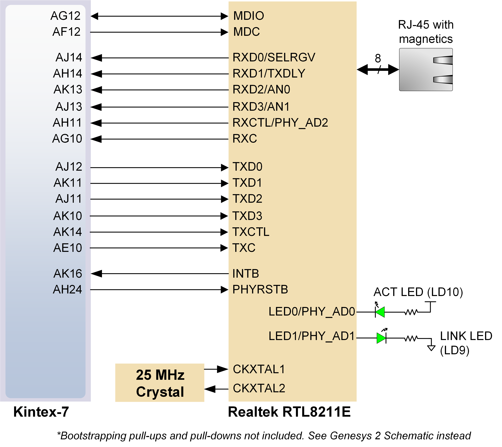
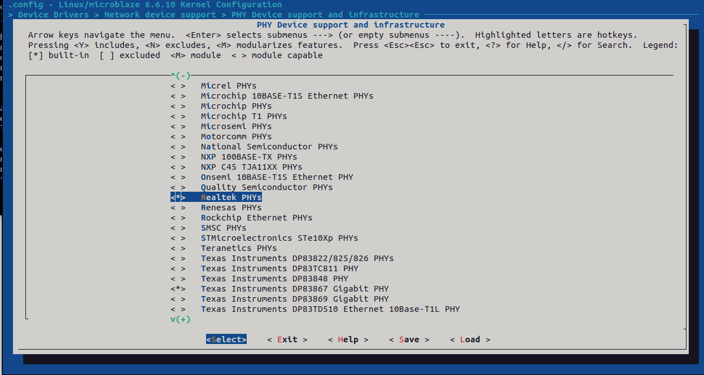
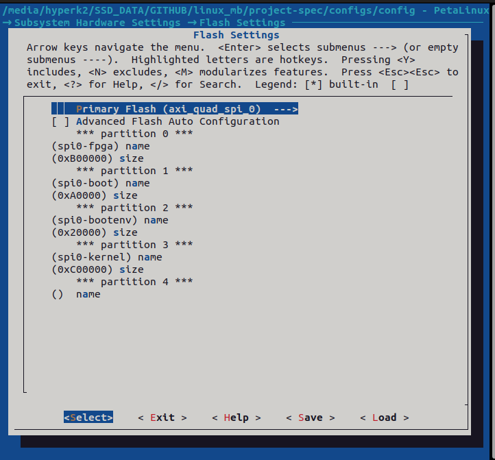
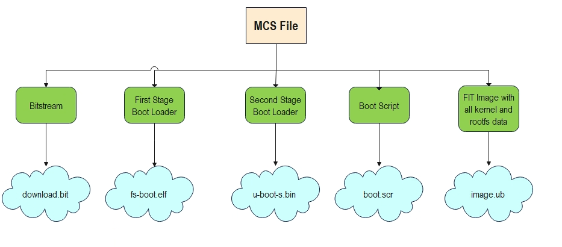
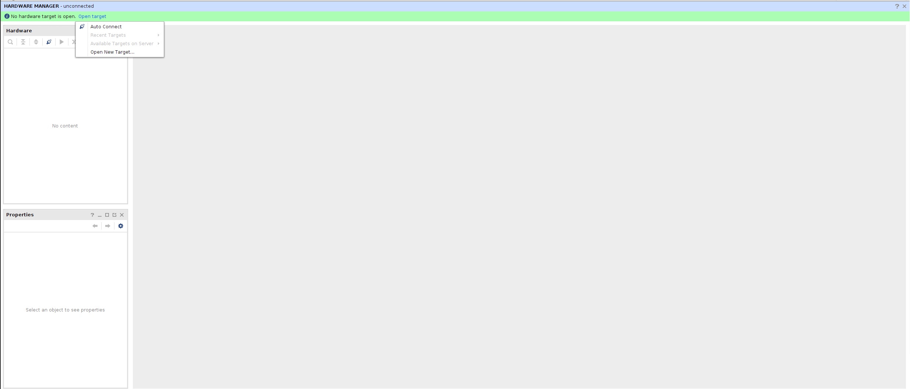
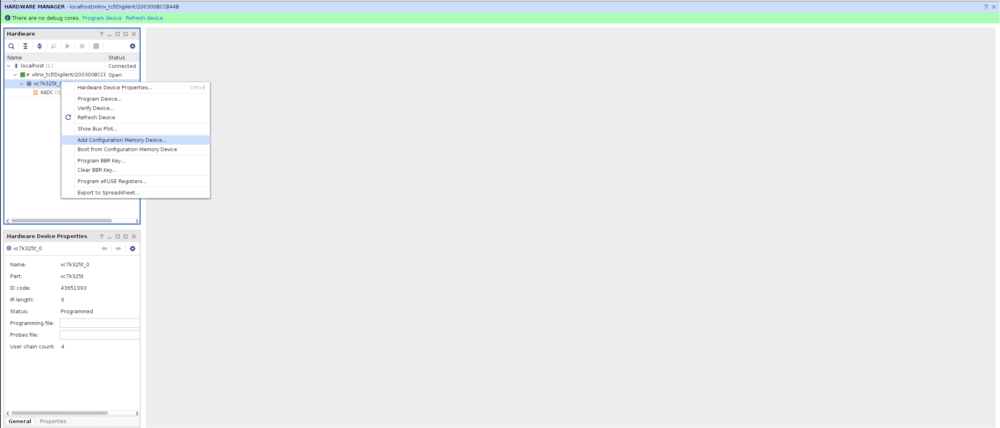
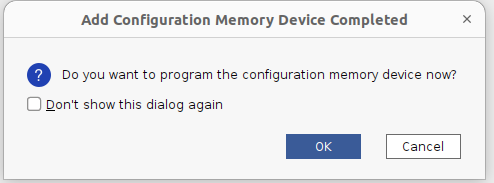
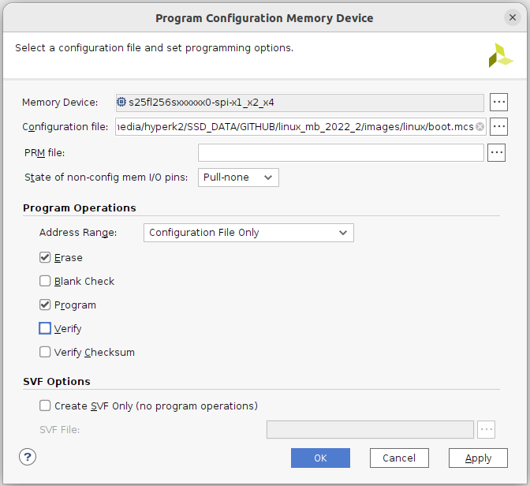
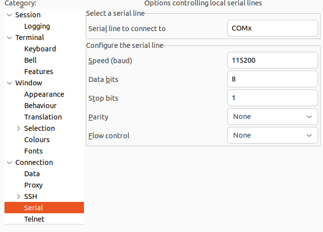

In this section, we are going to build a custom Linux image using the Vivado XSA. The software that will be used are the Petalinux Tools 2024.1.

<script src="./static/step-navigation.js"></script>
<link rel="stylesheet" href="./static/step-navigation.css" />

<div class="step-container">

<div class="step active" data-step="1">
<h2>Set Up Petalinux Project</h2>

1. Connect to the Linux VM through *Windows Remote Desktop* application using the IP address and the username and password provided by the teacher.
2. Open a terminal in Linux and run the script that configures the environment for Petalinux building commands.

```shell
source /opt/petalinuxTools/2024/settings.sh
```

3. Create the Petalinux project. This project will be the center of all the changes made in the software for building the Linux platform and software that comes with it.

```shell
petalinux-create -t project -n linux_mb_2024 --template microblaze
```

> [!question] Question 8
> What options are there for the template argument?
> Check UG1144 Petalinux Tools Reference Guide.
</div>

<div class="step" data-step="2">
<h2>Load Hardware and Configure sstate Cache</h2>

4. We have to tell Petalinux which hardware we have so that the correct software and drivers components are built. As the in the FPGA we can include any hardware that our imagination (and our Verilog coding skills) allow us, Petalinux Tools need to know exactly what we included and what not.

```shell
petalinux-config --get-hw-description <folder where the xsa was copied> --silentconfig
```

5. Now, we are changing the sstate-cache directory which Yocto uses for this project. Run the following command and go to *Yocto Settings > Network sstate feeds URL*

```shell
petalinux-config
```


6. Change the content of the textbox to: *http://hyperk1.i3m.upv.es/sstate-cache-microblaze/sstate-cache*



> [!info] What is sstate cache? (From Yocto Wiki)
> To speed up the build process, sstate provides a cache mechanism, where sstate files from server can be reused to avoid build from scratch if the producer and consumer of the sstate have the same environment. With perfect case, we can achieve more than 80% time decreasing.
</div>

<div class="step" data-step="3">
<h2>Configure Linux Kernel and libxcrypt Fix</h2>

7. There is one hardware added: the Ethernet link that requires additional drivers because there is a PHY chip in the board that negotiates the link. This is a Realtek chip that has their own set of drivers.
Run the following command to enter into the kernel customization menu:

```shell
petalinux-config -c kernel
```



8. You will be presented with a Kconfig menu that allows to configure every single part of the Linux kernel, to tune it to the developer needs. Go to the corresponding section by using the arrow keys and the *Enter* key and check the Realtek PHY support using the *y* key:

```
> Device Drivers > Network device support > PHY Device support and infrastructure
```



9. Go to the following directory:
`<petalinux-project-folder>/components/yocto/layers/poky/meta/recipes-core/libxcrypt`

10. Open *libxcrypt.inc* and change the SRCREV variable to `"55ea777e8d567e5e86ffac917c28815ac54cc341"`

> [!info]
> This last step is made to fix a bug in one of the Yocto recipes used in Petalinux Tools 2024.1. What it does is to change the commit SHA where it downloads the source code from to compile the libxcrypt library. It basically updates the library from version 4.4.30 to the latest one, where this bug has already been fixed.
</div>

<div class="step" data-step="4">
<h2>Configure Boot Flow Offsets</h2>

Let's analyze the boot flow. Petalinux will boot from the QSPI flash, using the bootflow that we saw in the slides. For that it will need several files and each one of them must be in a specific offset that we are configuring the Petalinux boot flow to find that file. To configure those offsets the following steps must be made:

11. Go to the main Petalinux configuration screen:

```shell
petalinux-config
```

12. Navigate through the menu to the qspi offset section:

```shell
 → Subsystem Hardware Settings → Flash Settings
```

13. Configure the offset using the following options:


> [!question] Question 9
> What does each partition represent? Fill the table below.
> How is the required size of each partition computed?

| Partition    | Size     | Description |
|--------------|----------|-------------|
| spi0-fpga    | 0xB00000 |             |
| spi0-boot    | 0xA0000  |             |
| spi0-bootenv | 0x20000  |             |
| spi0-kernel  | 0xC00000 |             |
</div>

<div class="step" data-step="5">
<h2>Edit Device Tree for Realtek PHY</h2>

Including a new driver means that we need to configure it. This is done through the device tree, as explained in the theory slides. For this lab session we are going to configure the Realtek PHY included in the Genesys 2:

14. In the project folder, go to `project-spec/meta-user/recipes-bsp/device-tree/files`.
15. Open the *system-user.dtsi* file.
16. Add the following lines of text to the file:

```dts
&axi_ethernet_0 {
    phy-handle = <&phy0>;
    axi_ethernet_0_mdio: mdio {
        #address-cells = <1>;
        #size-cells = <0>;
        phy0: ethernet-phy@0 {
            device_type = "ethernet-phy";
            compatible = "ethernet-phy-id001c.c915";
            reg = <1>;
        };
    };
};
```

> [!question] Question 10
> What does the compatible property and the reg property represent?

> [!question] Question 11
> Where can you get the information of what to write in the compatible and the reg property?

17. Build just the device-tree to check for any Syntax Errors that might have been committed.

```shell
petalinux-build -c device-tree
```

> [!info]
> The command in the previous step builds just the device-tree component, through the -c parameter.
</div>

<div class="step" data-step="6">
<h2>Boot and Validate Petalinux</h2>

The project is completely configured. Now let's build an image and flash it into the Genesys 2 board.

18. The command for building Petalinux images is `petalinux-build`. It takes very long to run so we are going to use a prebuilt image.
19. For completeness, there is another command, called `petalinux-package`, that takes all the outputs from the previous one and puts it inside an MCS (Memory Configuration System) file. This file is used to initialize the QSPI flash inside the Genesys 2 board with all the required files for booting Linux.



> [!question] Question 12
> Open the MCS with a text editor. What do you find inside?

PONER AQUI TODAS LAS CAPTURAS

20. Open Vivado 2024.1 and go to Hardware Manager.
21. Click on Open Target -> Auto Connect.

22. Right click on the FPGA device found (kcu7) and click on *Add Configuration Memory Device*.

23. In the window, select the correct memory device: *s25fl256xxxxxx0*.

24. Click OK and say Yes to the message prompting you to program the memory device.

25. Check the MCS option in the next window and add the boot.mcs boot file that you have to download from PoliformaT.

26. Click OK and wait for the device to be programmed.
27. Once programmed, open Putty and select the serial terminal with the following options:
- Serial Line: COMx (check in Windows device manager)
- Speed: 115200
- Bits: 8
- Stop bits: 1
- Parity: None
- Flow Control: OFF



28. Turn off and back on the board and wait for Petalinux to boot.

### Running some commands in Petalinux

Once in the login prompt, enter the `petalinux` user and then write a new password when asked by the system.

> [!question] Question 13
> Run the following commands and copy and paste the output:
> - `cat /proc/cpuinfo`
> - `cat /proc/meminfo`
> What kind of information does each one of these commands show?
</div>

<div class="navigation">
  <button id="prevBtn">Previous</button>
  <div class="step-indicator">
    <span><span id="currentStep">1</span> of <span id="totalSteps">6</span></span>
  </div>
  <button id="nextBtn">Next</button>
</div>

</div>

---

[Previous: Exercise 1](chapter-4-vivado-microblaze.md)