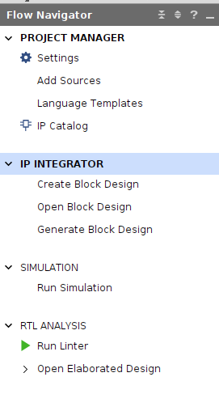
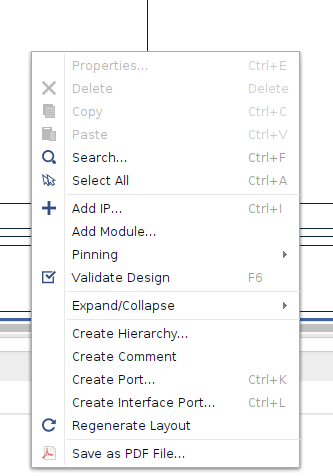
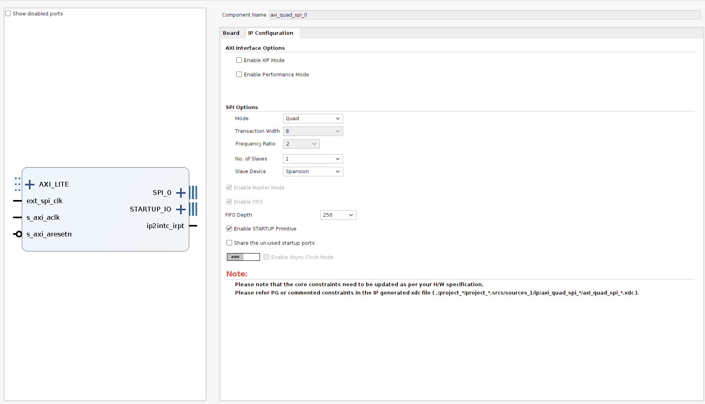
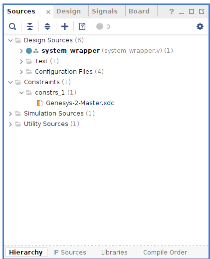
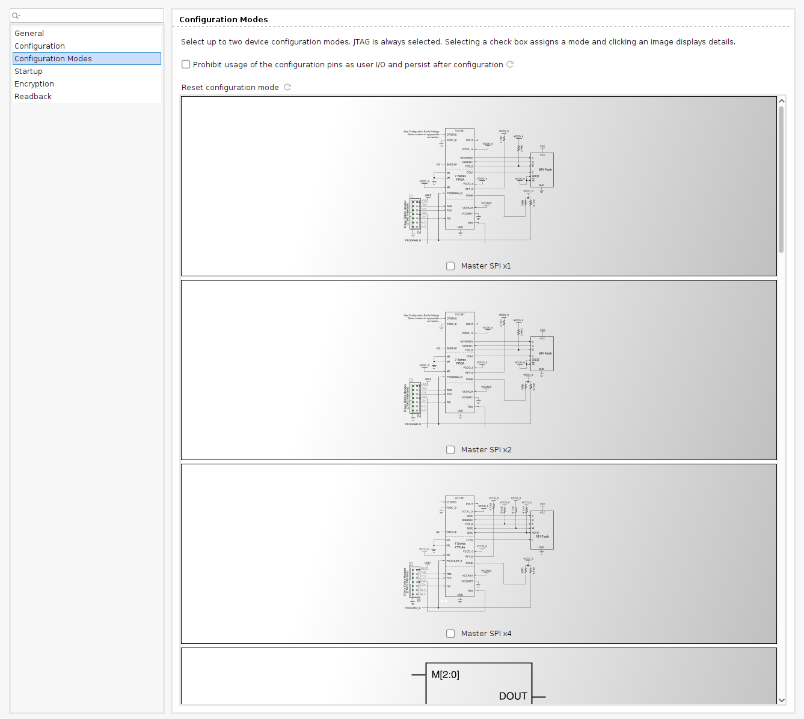

For this section, only Vivado 2024.1 software is needed.

<script src="./static/step-navigation.js"></script>
<link rel="stylesheet" href="./static/step-navigation.css" />

---

[Next: Exercise 2](chapter-4-petalinux-boot.md)

<div class="step-container">

<div class="step active" data-step="1">
<h2>Prepare and Open the Vivado Project</h2>

1. Download the archived project from PoliformaT and unzip it in a folder of your choice.

> [!warning]
> UNZIP THE FOLDER IN A PATH THAT IS NOT VERY LONG AS WINDOWS CAN COMPLAIN ABOUT THIS!

2. Open Vivado and click on Open Project.
3. Go to the folder where the project was unzipped and open the *.xpr* file to open the Vivado project.
4. Follow the instructions in the next steps to complete the Vivado project, making it ready for booting up Linux.
</div>

<div class="step" data-step="2">
<h2>Include QSPI Controller</h2>

The project is almost completed, only one IP block is left: The QSPI controller.

> [!question] Question 1
> Why is the QSPI controller needed?

1. Click on *Open Block Design* in the IP Integrator section.



2. Right click in an empty part of the Diagram screen and click on *Add IP*.



3. Select AXI Quad SPI.
4. Double click on the IP and configure the IP as shown in the photo.



> [!question] Question 2
> How is it known that the Mode must be Quad and the Slave Device Spansion?
> Tip: Look at the Genesys 2 reference manual for the QSPI flash model.
</div>

<div class="step" data-step="3">
<h2>Connect the QSPI IP Ports</h2>

5. Connect the IP to the following ports. For that just hold click on the port and draw the cursor to the destination port where you want to connect the first port to:
- AXI_LITE -> M02_AXI of AXI Interconnect
- ext_spi_clk -> ui_clk from MIG 7 Series
- s_axi_aclk -> ui_clk from MIG 7 Series
- s_axi_aresetn -> peripheral_aresetn from rst_mig_7series_0_100M
- ip2intc_irpt -> concat block that then goes to the AXI Interrupt Controller
- SPI_0 -> Output port called SPI_0_0.

> [!note] Output port to the SPI Flash
> In case the SPI_0_0 output port is not in the design or was erased by accident, you can create it again by right clicking on the SPI_0 interface of the AXI QSPI Controller API and click on *Make External*
</div>

<div class="step" data-step="4">
<h2>Analyze Microblaze and Cache Configuration</h2>

In this section we are going to edit the Microblaze processor:

6. Double click on the Microblaze processor.

> [!question] Question 3
> What is needed for the Microblaze to run Linux?

7. Go to the cache page and increase the cache to 64kB.

> [!question] Question 4
> Check the Base Address and High Address values in the Instruction and Data Cache.
> Where are these values drawn from? What do they represent?
</div>

<div class="step" data-step="5">
<h2>Address Editor and Internal Memory</h2>

8. Go to the Address Editor tab.
9. Right click and in the contextual menu click on *Assign All*. This will assign physical memory spaces in the addressing space of the CPU.

> [!question] Question 5
> Change the Available internal memory of the CPU from 8kB to 64kB.
> What effect will this cause in our design? What is it useful for?

10. Make a screenshot expanding all the elements from the address editor and attach it in the PoliformaT task.
</div>

<div class="step" data-step="6">
<h2>Edit XDC Constraints</h2>

Add the following constraints to the XDC file. The XDC file is in the Sources section, Constraints folder.



```tcl
set_property BITSTREAM.CONFIG.SPI_BUSWIDTH 4 [current_design]
set_property BITSTREAM.GENERAL.COMPRESS TRUE [current_design]
```

> [!question] Question 6
> What do the previous commands do?
</div>

<div class="step" data-step="7">
<h2>Select Bootup Method</h2>

11. Run Synthesis of the design by clicking the corresponding button in the Flow Navigator (left part of the screen).
12. After Synthesis has finished, click on the *Open Synthesized Design* button just below the *Run Synthesis* button.
13. In the option bar on the top of Vivado, click on Tools -> Edit Device Properties -> Configuration modes -> Master SPIx4.

> [!warning] If Edit Device Properties does not appear!
> It is very important that you Open the Synthesized design before, else, the option will not appear!


</div>

<div class="step" data-step="8">
<h2>Generate Bitstream and Check Utilization</h2>

14. Click on Generate Bitstream to go through the whole build process.
15. Open Implemented Design.
16. Click on *Report Utilization* and check the utilization report to see which FPGA resources were used.
17. Attach a screenshot of the Summary section of the Utilization Report.
</div>

<div class="step" data-step="9">
<h2>Generate XSA File</h2>

18. Go to File -> Export -> Export Hardware.
19. Check *Include Bitstream*.
20. Select where you want to save the XSA file.
21. Click Next several times and Finish.

> [!question] Question 7
> What does this file include?
> Tip: Open it using 7zip.
</div>

<div class="navigation">
   <button id="prevBtn">Previous</button>
   <div class="step-indicator">
      <span><span id="currentStep">1</span> of <span id="totalSteps">9</span></span>
   </div>
   <button id="nextBtn">Next</button>
</div>

</div>

---

[Next: Exercise 2](chapter-4-petalinux-boot.md)

</div>