[Previous: Exercise 1](chapter-5-exercise-1.md)

<link rel="stylesheet" href="./static/step-navigation.css" />

<h2>Prepare the Vitis Linux Platform</h2>

AMD provides an Integrated Development Environment (IDE) for their FPGA solutions, where all the tools needed for building and debugging software are included. This software is called Vitis.

In this section, you will code an application for the Microblaze CPU that you built in the previous session.

1. We are going to need both the XSA from Vivado 2024.1 and an SDK that contains the Microblaze cross-compiler and the sysroot. Download both the XSA and SDK.zip from PoliformaT.
2. Extract SDK.zip in a folder of your choice.
3. Open Vitis Classic 2024.1.
4. Choose the workspace you want to work in (recommended to leave the default one).

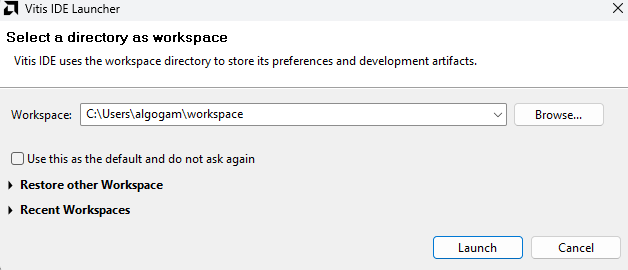

5. Create a platform project.

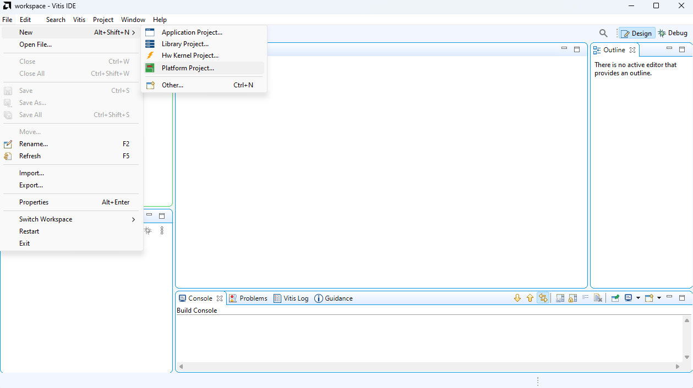

> [!info] About a platform project
> The platform project is the project that contains all the hardware information of the board and the type of OS it is running (Linux, FreeRTOS, or standalone). This information is gathered from the XSA generated by Vivado. For Linux, more information is required, such as the sysroot.

<h2>Configure Linux and Sysroot</h2>

6. Select the XSA that you downloaded previously.

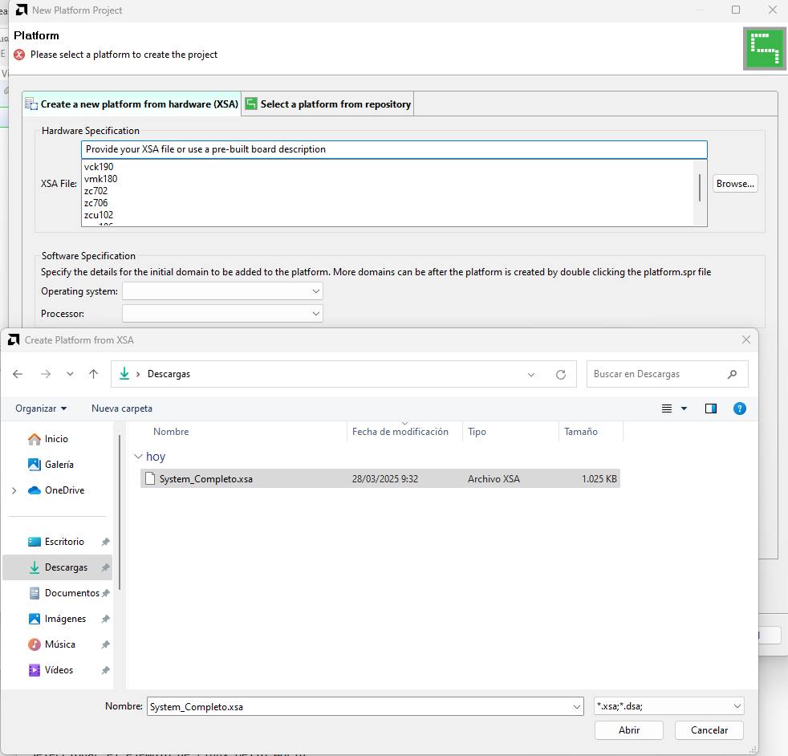

7. When the Software specification loads, select in the Operating system dropdown *Linux*.

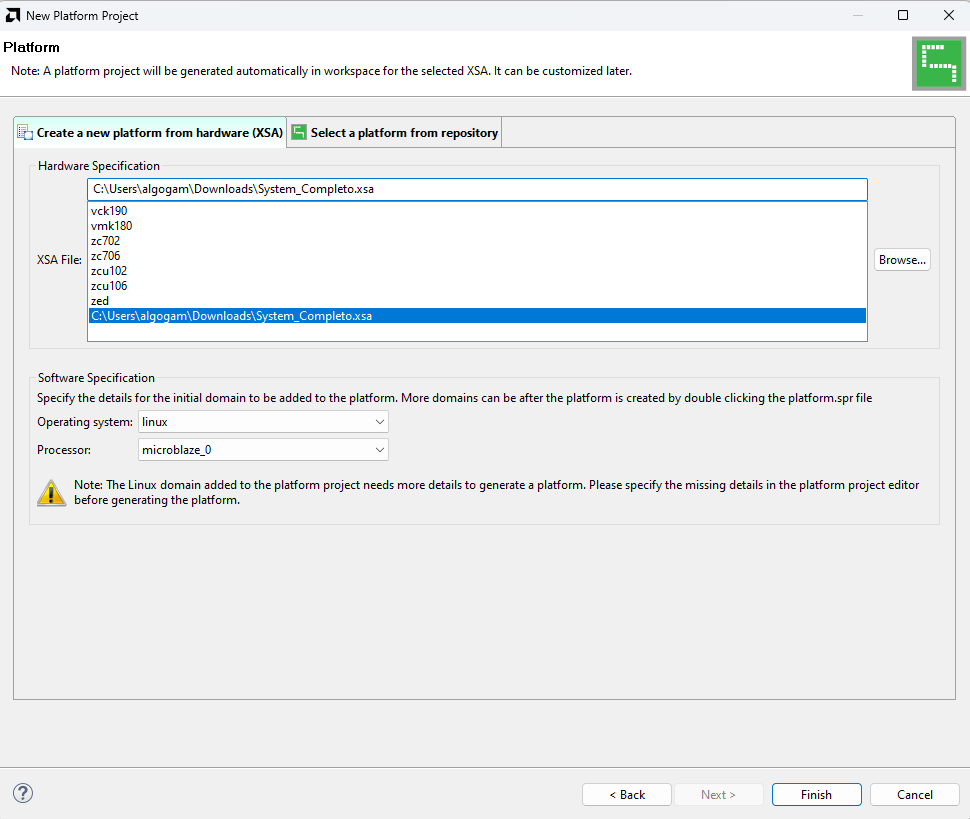

8. Click Finish to create the platform project.
9. Click on `platform.spr` and then go to the Linux on `microblaze_0` section.
10. Search for Sysroot and click the Browse button next to it.

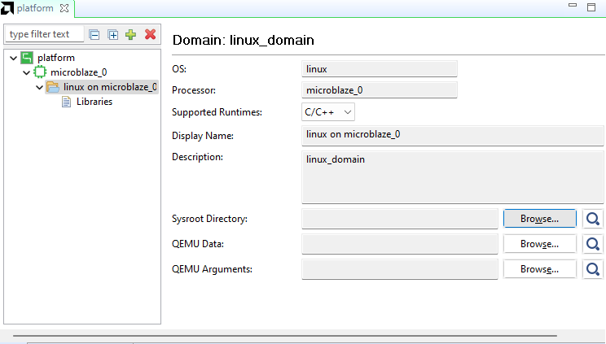

11. Go to the folder where you unzipped the SDK.zip file and select `<sdk-directory>/sysroots/microblazeel-v11.0-bs-cmp-re-mh-div-xilinx-linux`.

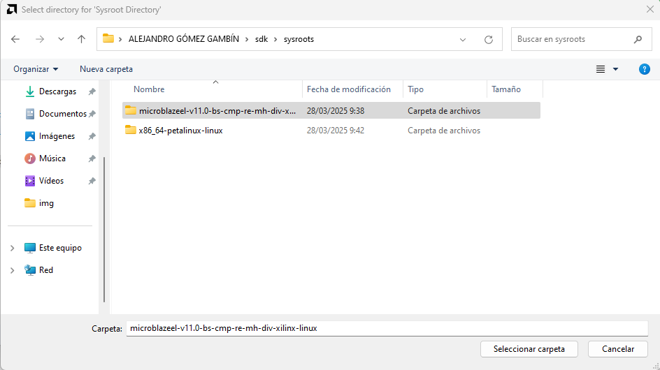

> [!info] About sysroot
> It is a directory which is considered to be the root directory for the purpose of locating headers and libraries. It is a directory that contains a full Linux rootfs made for the target architecture of the CPU, so it contains all the libraries (.so) and headers (.h) files specially made for that architecture.

> [!danger]
> The sysroot is completely needed as we CANNOT use the libraries included in the host OS because they are made for a different architecture (x86).

> [!question] Question 2
> What does the SDK.zip file include? Explain what is there in each of the two folders of sysroots.

<h2>Create and Run Linux Hello World</h2>

12. Build the platform project by clicking on the *hammer* icon.

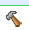

13. Create the application project.

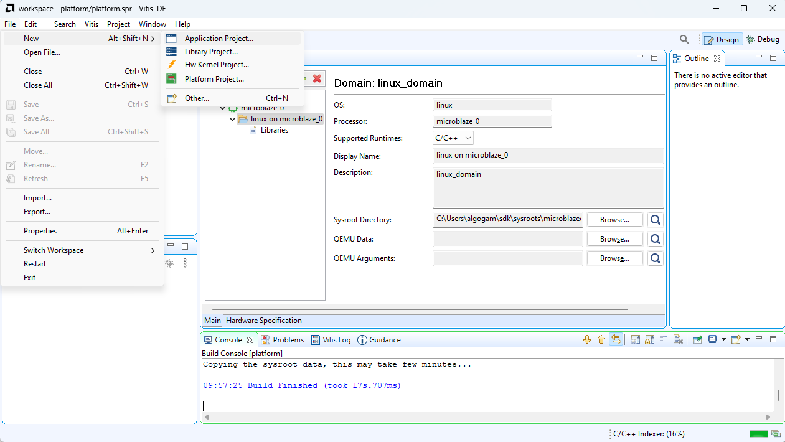

14. Select the platform project created before in the following screen:

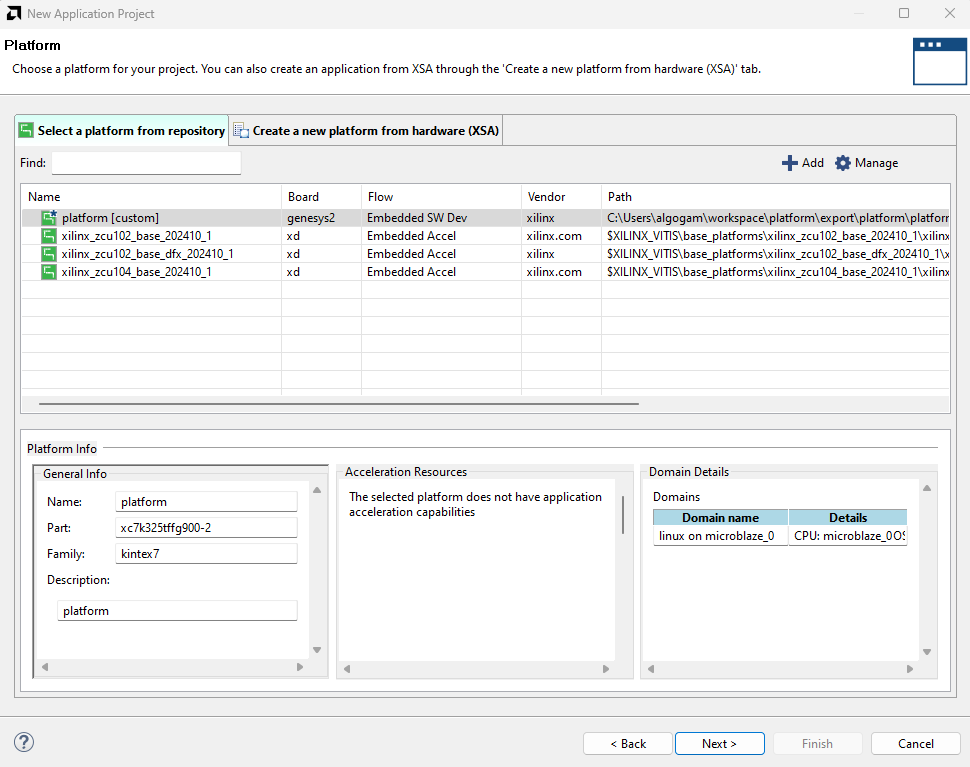

15. Click Next and input a name for the system project.
16. Click Next again until you reach the following screen. Select as template the *Linux Hello World*.

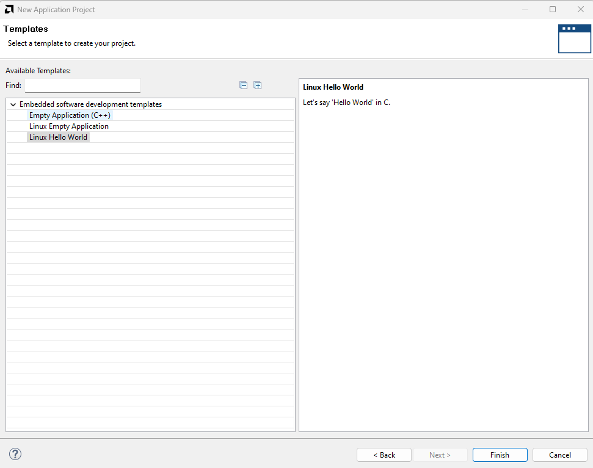

17. Click Finish to create the application project.
18. Build the application project using the *Debug* profile.

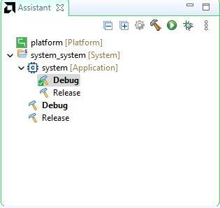

19. Once built, go to the Run button dropdown list and click on *Run Configurations...*.

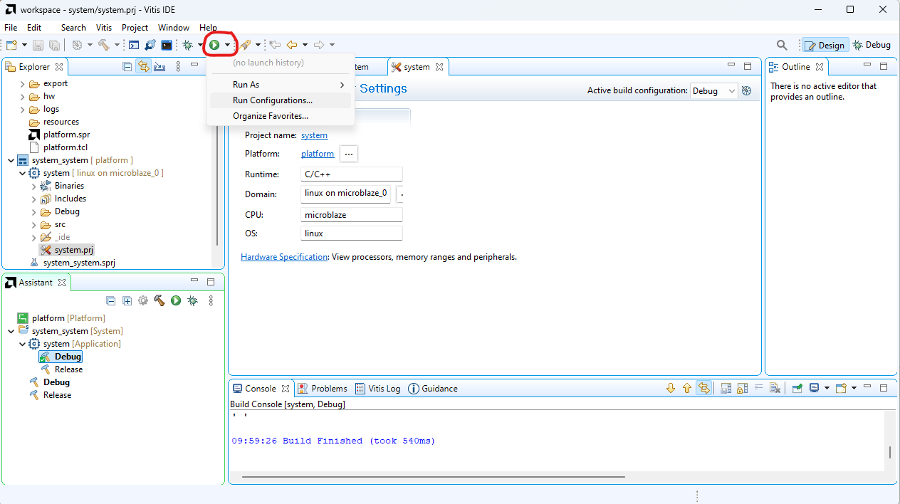

20. Create a new configuration of type TCF (Single Application Debug).

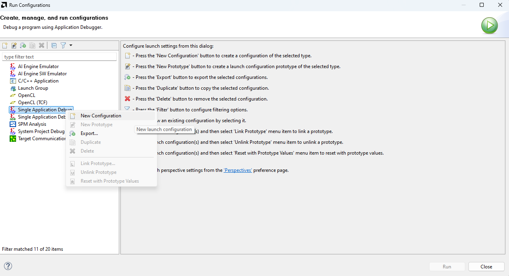

21. In the Main tab:
- Add a new Agent with the IP address of the Genesys 2 board (40.0.0.2).
- Click on Test Connection and ensure that it successfully establishes connection.

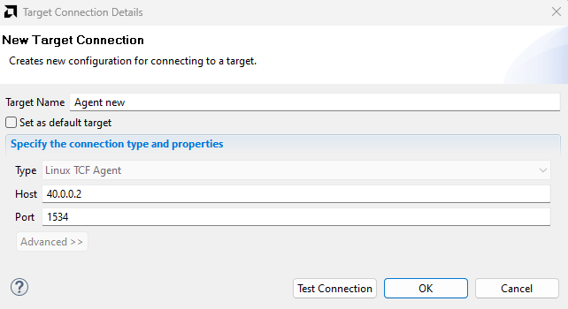

22. In the Application tab:
- Change the working directory to `/home/petalinux`.
- Change the remote directory to `/home/petalinux/<name-of-the-.elf>`.

23. Click Apply and then Run.
24. The Output terminal of the application should automatically open below and display the *Hello World*.

> [!question] Question 3
> What does the TCF acronym stands for? What is it useful for?

> [!tip] How does the application work?
> The message *Hello World* is printed by the application by the board to stdout using `printf`, then the TCF agent connects stdout of the application to the PC, so the message is displayed on the PC.

  <button id="prevBtn">Previous</button>
  

    1 of 3
  

  <button id="nextBtn">Next</button>

---

[Next: Exercise 3](chapter-5-exercise-3.md)
