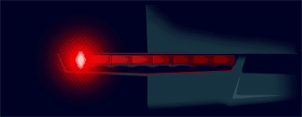

[Previous: Exercise 3](chapter-5-exercise-3.md)

> [!abstract] Exercise
> Code an application that, after flipping one switch, makes the Knight Rider lights, that is, that the LEDs are being turned on and off in a sequence first from left to right and then from right to left with an interval of 1 second. If the switch is flipped back off, the LEDs should turn off

## Expected Behavior

- Use one switch as enable condition for the sequence.
- Run a left-to-right LED sweep and then right-to-left.
- Keep a 1 second interval between LED state transitions.
- Build and validate execution on the board.

This is an example of how the Knight Rider effect should look, considering that the Genesys 2 LEDs are green, not red:

---

[Next: Exercise 5](chapter-5-exercise-5.md)
